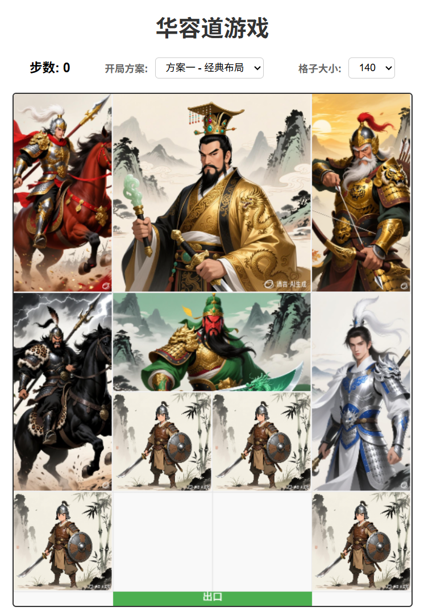
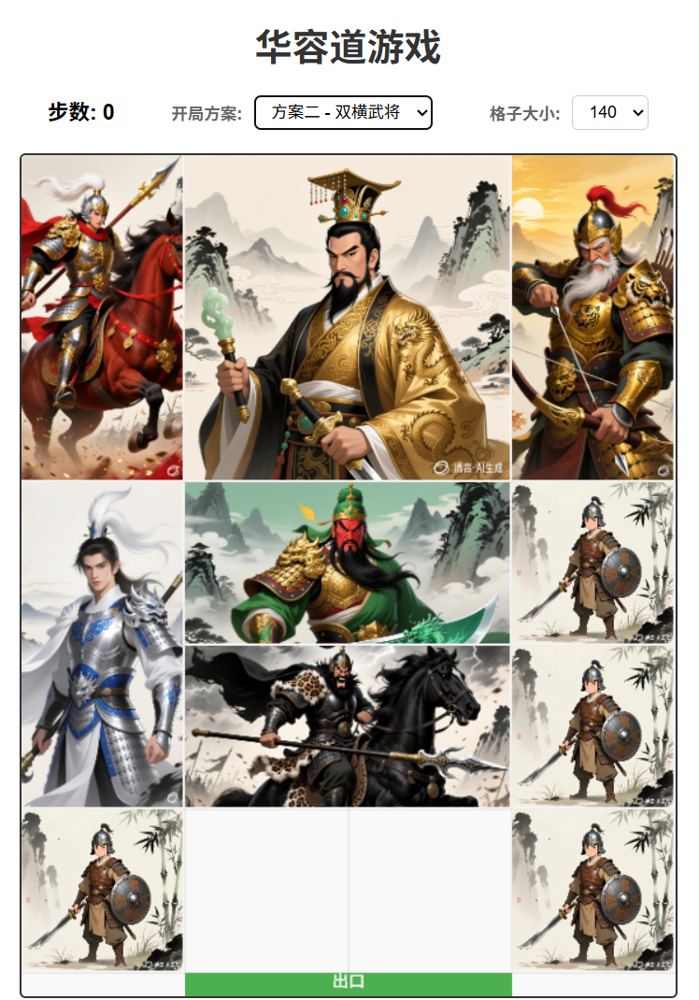
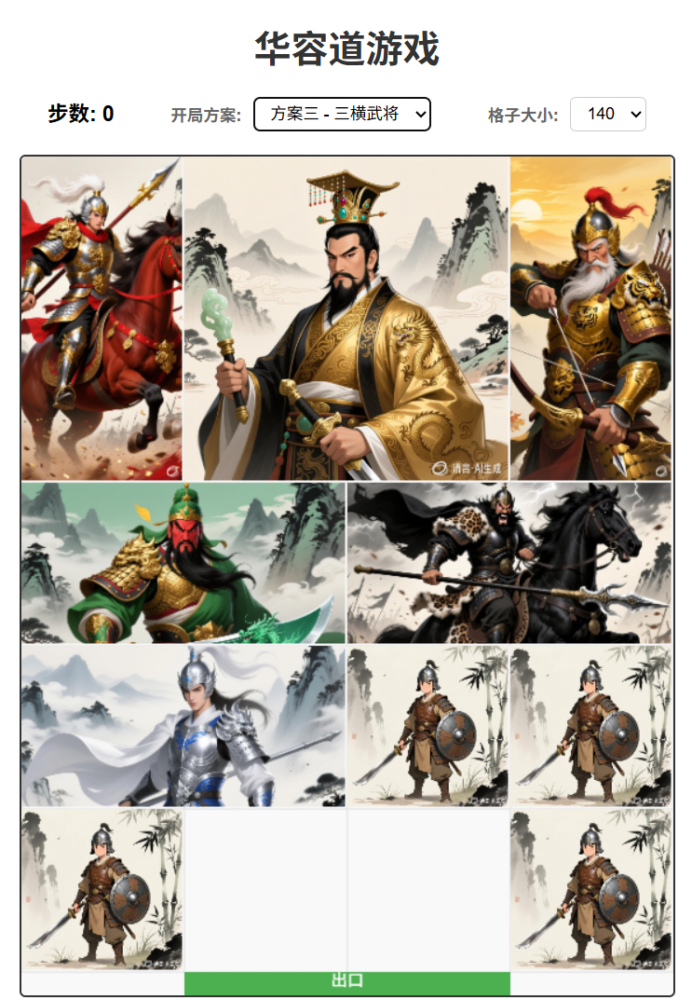
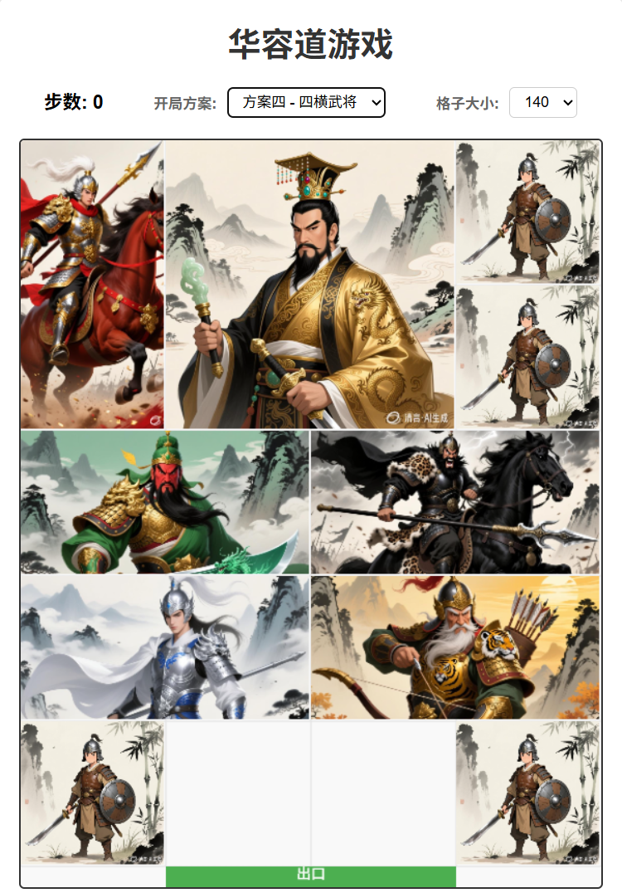
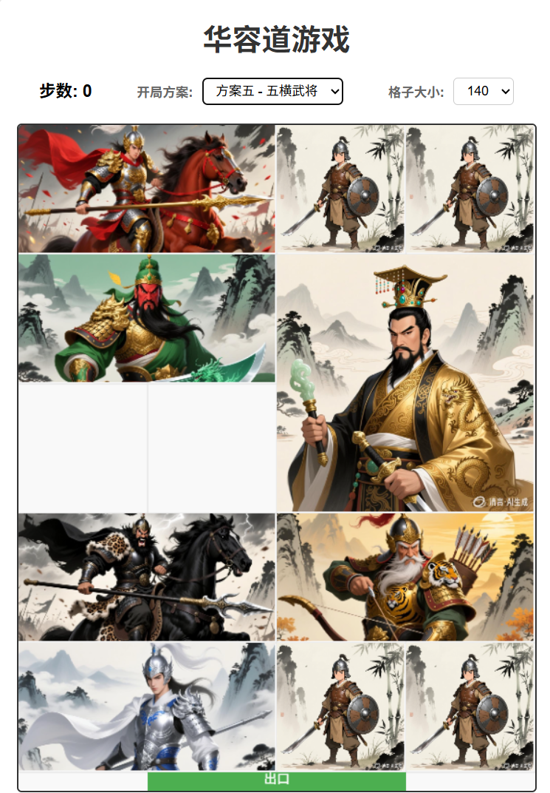

# 华容道游戏 (Huarongdao Puzzle Game)

一个基于HTML5 Canvas实现的经典华容道益智游戏，支持多种开局方案和自动求解功能。


## 游戏简介

华容道是中国传统的益智游戏，通过移动棋盘上的方块，帮助曹操（2×2的大方块）从棋盘顶部的出口逃出。游戏考验玩家的逻辑思维和空间想象能力。

## 游戏规则

1. **棋盘规格**：4列5行的网格
2. **目标**：将曹操（红色大方块）移动到底部中央的出口
3. **操作方式**：
   - 使用方向键控制选中方块的移动
   - 或者直接点击方块进行拖拽
   - 只能在空位处移动方块
4. **限制**：方块不能重叠，不能超出棋盘边界

## 功能特性

### 🎮 游戏功能
- **多种开局方案**：提供5种不同的初始布局

  | 方案 | 名称 | 预览 |
  |------|------|------|
  | 方案一 | 经典布局 |  |
  | 方案二 | 双横武将 |  |
  | 方案三 | 三横武将 |  |
  | 方案四 | 四横武将 |  |
  | 方案五 | 五横武将 |  |

- **可调节格子大小**：支持80px到200px的7种尺寸
- **步数统计**：实时显示移动步数
- **重置游戏**：一键恢复到初始状态
- **自动求解**：使用BFS算法自动找到最优解

### 🎨 视觉效果
- 精美的角色图片显示
- 流畅的拖拽动画
- 响应式布局设计
- 清晰的UI界面

## 技术实现

### 技术栈
- **前端**：HTML5, CSS3, JavaScript (ES6+)
- **图形渲染**：Canvas 2D API
- **算法**：广度优先搜索（BFS）用于自动求解

### 核心模块
1. **游戏引擎** (`script.js`)
   - 游戏状态管理
   - 碰撞检测
   - 移动逻辑
   - 自动求解算法

2. **UI界面** (`index.html`)
   - 游戏画布
   - 控制面板
   - 选择器组件

3. **样式设计** (`style.css`)
   - 响应式布局
   - 动画效果
   - 主题样式

### 算法说明
- **BFS（广度优先搜索）**：从当前状态开始，逐层探索所有可能的移动，直到找到目标状态
- **状态哈希**：使用唯一标识符表示每个游戏状态，避免重复搜索
- **路径记录**：保存从初始状态到目标状态的完整路径

## 游戏角色

| 角色 | 尺寸 | 图片说明 |
|------|------|----------|
| 曹操 | 2×2 | 红色大方块，需要移出的目标 |
| 关羽 | 2×1 | 横向放置的武将 |
| 张飞 | 1×2 | 纵向放置的武将 |
| 赵云 | 1×2 | 纵向放置的武将 |
| 马超 | 1×2 | 纵向放置的武将 |
| 黄忠 | 1×2 | 纵向放置的武将 |
| 士兵 | 1×1 | 小方块，用于填充空位 |

## 文件结构

```
Huarongdao/
├── index.html      # 游戏主页面
├── script.js       # 游戏核心逻辑
├── style.css       # 样式文件
├── .gitignore      # Git忽略文件
├── 开局/           # 开局方案预览图
    ├── 1.png
    ├── 2.png
    ├── 3.png
    ├── 4.png
    └── 5.png
├── images/         # 图片资源目录
    ├── 曹操.jpg
    ├── 曹操1.jpg
    ├── 曹操2.jpg
    ├── 华容道.jpg
    ├── 刘备1.jpg
    ├── 刘备2.jpg
    ├── 关羽.jpg
    ├── 张飞1.jpg
    ├── 张飞2.jpg
    ├── 黄忠1.jpg
    ├── 黄忠2.jpg
    ├── 赵云1.jpg
    └── 赵云2.jpg
```

## 使用方法

1. 克隆仓库到本地：
   ```bash
   git clone https://github.com/bpodq/Huarongdao.git
   ```

2. 打开 `index.html` 文件即可开始游戏

3. 或使用本地服务器运行（推荐）：
   ```bash
   # 使用Python
   python -m http.server 8000
   
   # 然后访问 http://localhost:8000
   ```

## 操作说明

### 键盘控制
- **方向键**：选中并移动方块
- **Tab键**：切换选中的方块

### 鼠标控制
- **点击方块**：选中该方块
- **拖拽方块**：直接拖动到目标位置

### 控制面板
- **开局方案**：选择不同的初始布局
- **格子大小**：调整游戏界面的大小
- **重置游戏**：恢复到当前选择的初始状态
- **自动求解**：自动演示解决方案

## 开发说明

### 添加新布局
在 `script.js` 中的 `layouts` 数组中添加新的布局配置：

```javascript
{
    name: "自定义布局",
    pieces: [
        // 方块配置
        { id: 'caocao', x: 1, y: 0, width: 2, height: 2, type: 'caocao' },
        // 更多方块...
    ]
}
```

### 自定义图片
在 `images/` 目录下添加新的图片文件，并在 `loadImages()` 函数中更新图片列表。

## 许可证

本项目采用 MIT 许可证 - 查看 [LICENSE](LICENSE) 文件了解详情。

## 贡献

欢迎提交 Issue 和 Pull Request 来改进这个项目！

## 作者

- 项目创建者：bpodq
- 游戏实现：基于经典华容道游戏规则

---

*感谢您游玩华容道游戏！祝您游戏愉快！* 🎮
